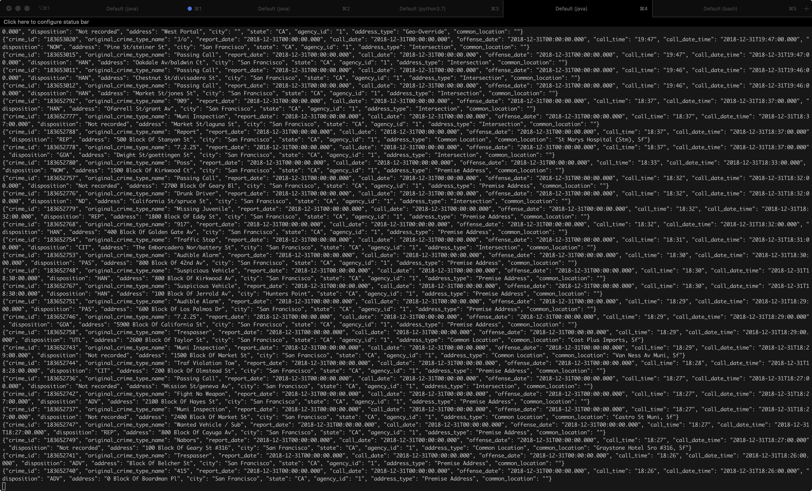
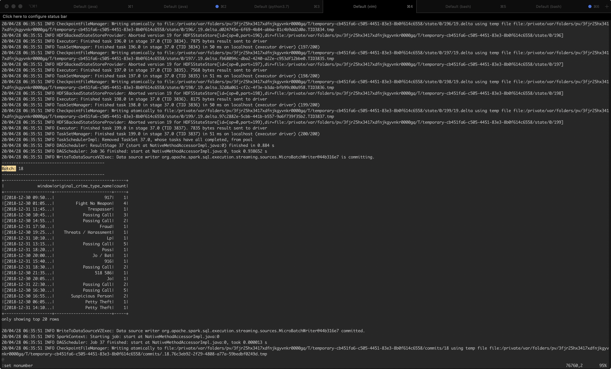
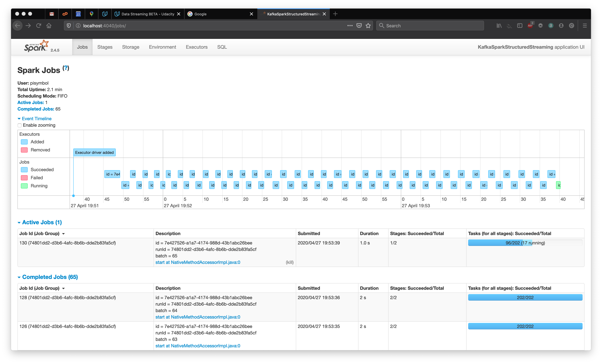

# SF Crime Statistics with Apache Spark Streaming

In this project, I built a simple Kafka server that created a single topic and streamed SF crime statistics to it in JSON format. I then developed a Spark Streaming application that reads from that topic and generates a few useful statistics. 

## Prerequisites

The following are required to complete this project:

* Apache Kafka 2.13-2.5.0
* Apach Spark 2.4.5
* Python 3.6+
* kafka-python
* pyspark

## Screenshots

As per the project rubric here are a list of screenshot results:

```kafka-console-consumer --topic com.udacity.crime.sf.stats.v1   --bootstrap-server localhost:9092 --from-beginning```



```python consumer_server.py```


```spark-submit --packages org.apache.spark:spark-sql-kafka-0-10_2.11:2.4.5  --master local[*] data_stream.py```



```http://localhost:4040```



## Questions

* How did changing values on the SparkSession property parameters affect the throughput and latency of the data?

I tried retricting the number of executors using the ```local``` parameter to 1, 2 and 4 cores which had a direct effect on the throughput of the data (more executors were able to work on a greater number of partitions).

*  What were the 2-3 most efficient SparkSession property key/value pairs? Through testing multiple variations on values, how can you tell these were the most optimal?

I looked at the Spark Session config options listed here:

http://spark.apache.org/docs/latest/configuration.html#viewing-spark-properties

I played with ```spark.executor.cores``` and ```spark.default.parallelism``` and looked at the parition and batch jobs from the Spark UI to see if I was getting any gains. I also measured time per batch to see which set of values worked best. In the end, I settled on the default (!) since my notebook's compute resources are limited (some settings literally crashed my notebook).